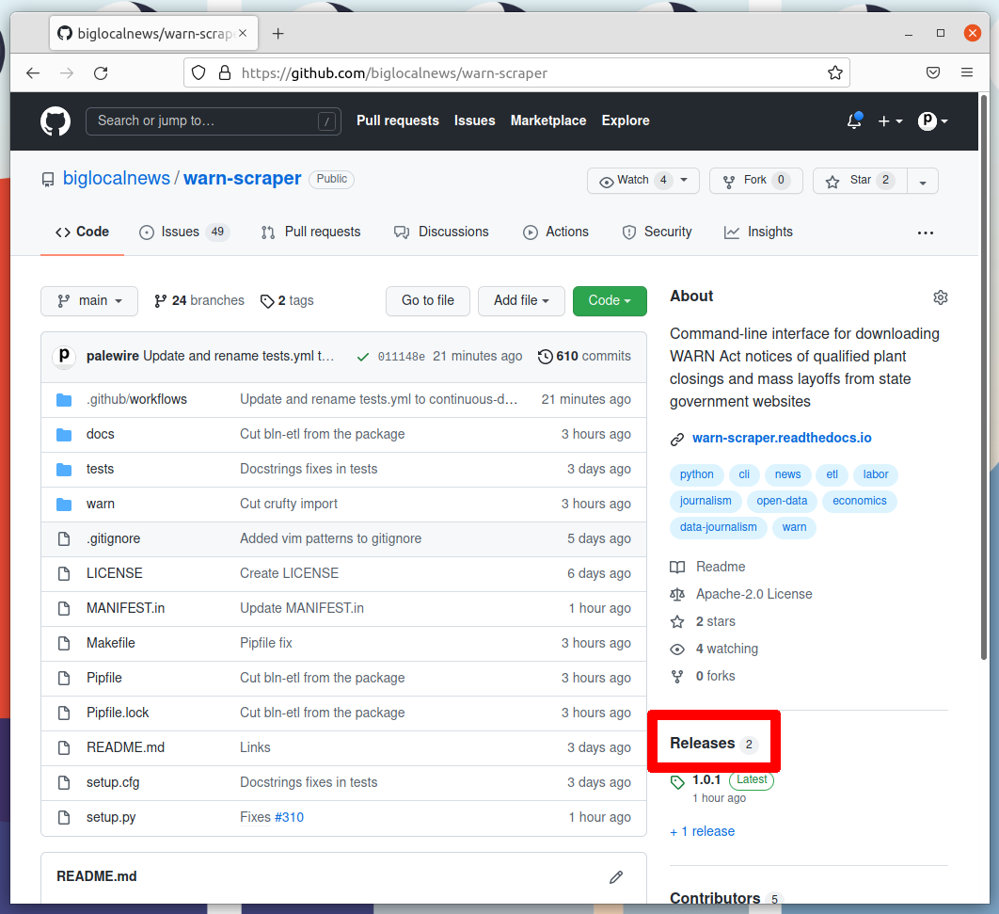
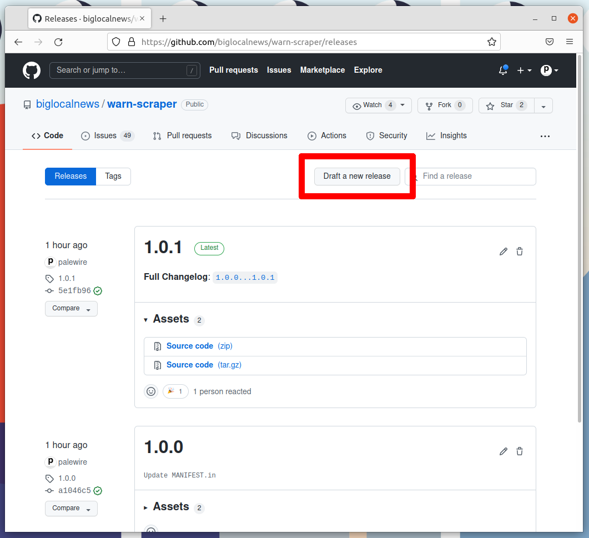
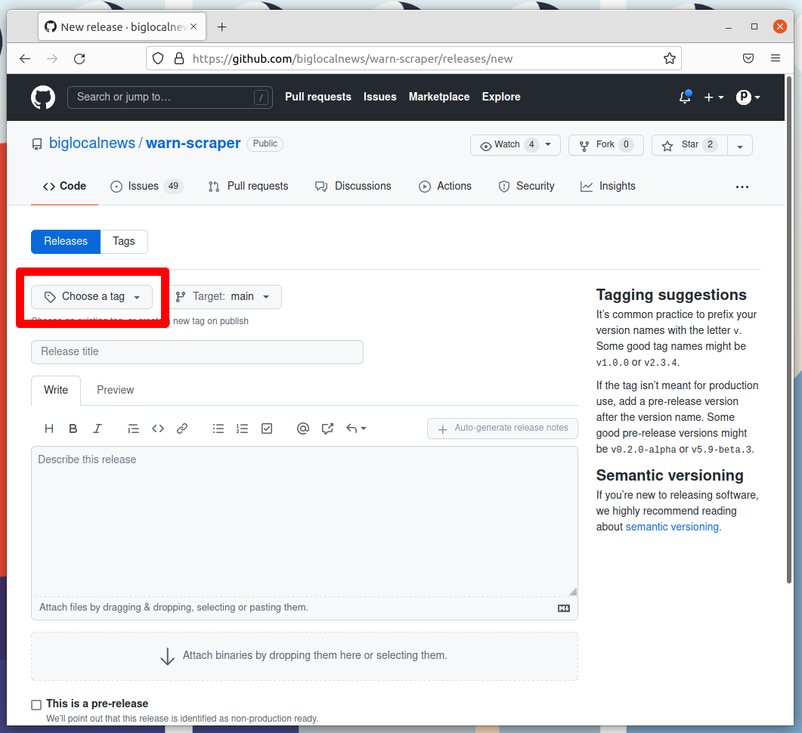
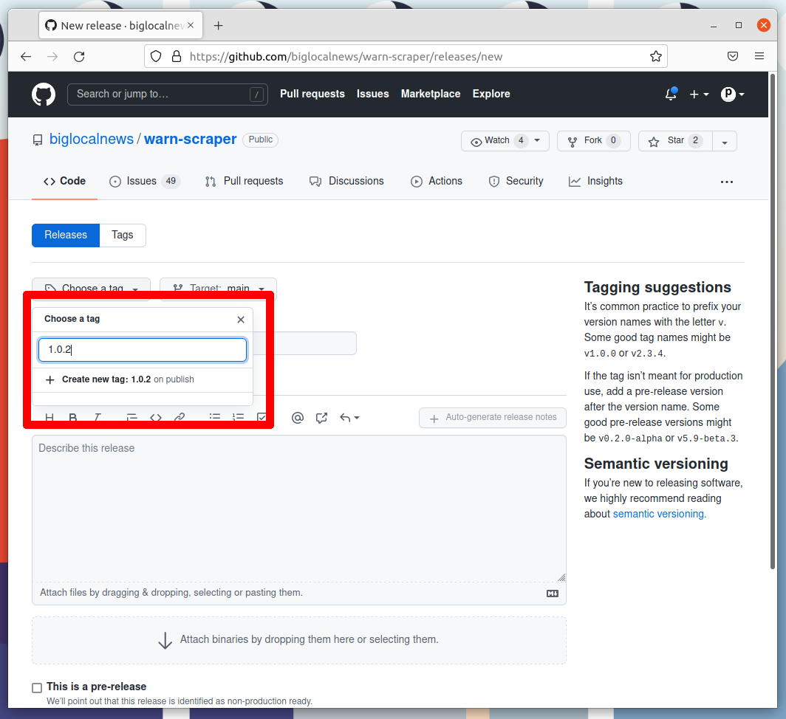
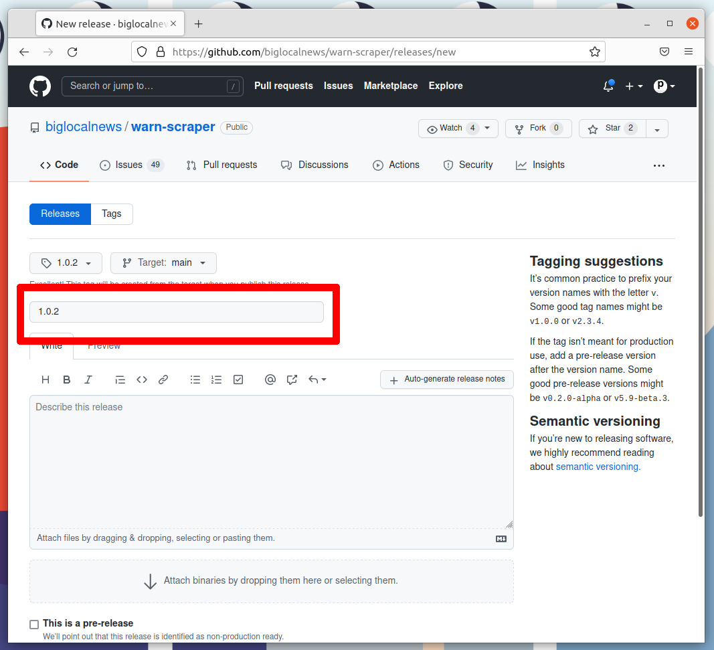
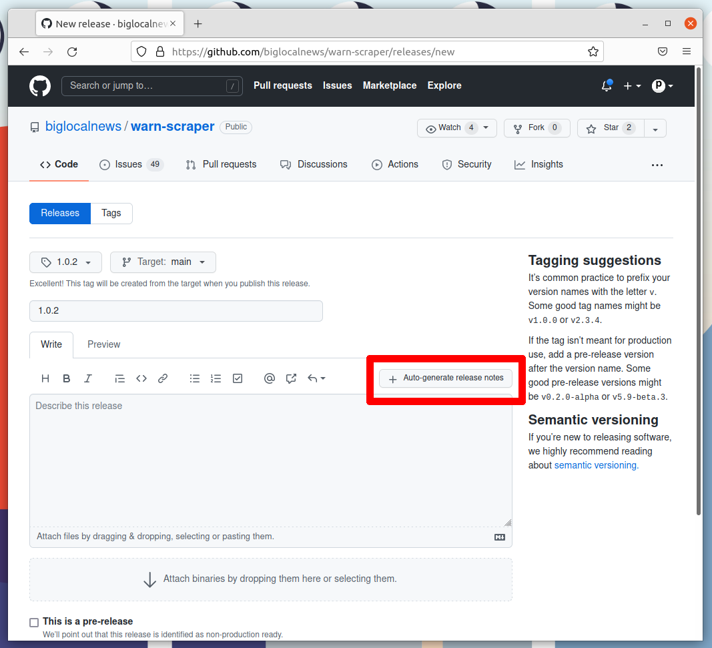
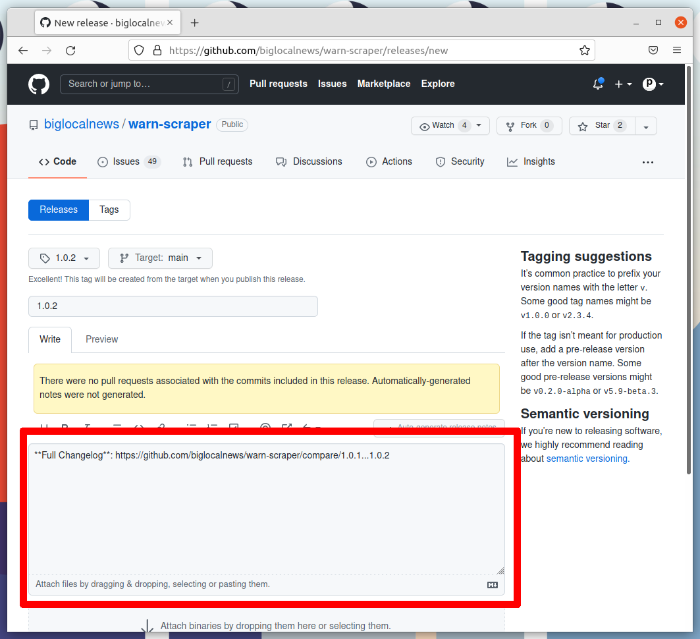
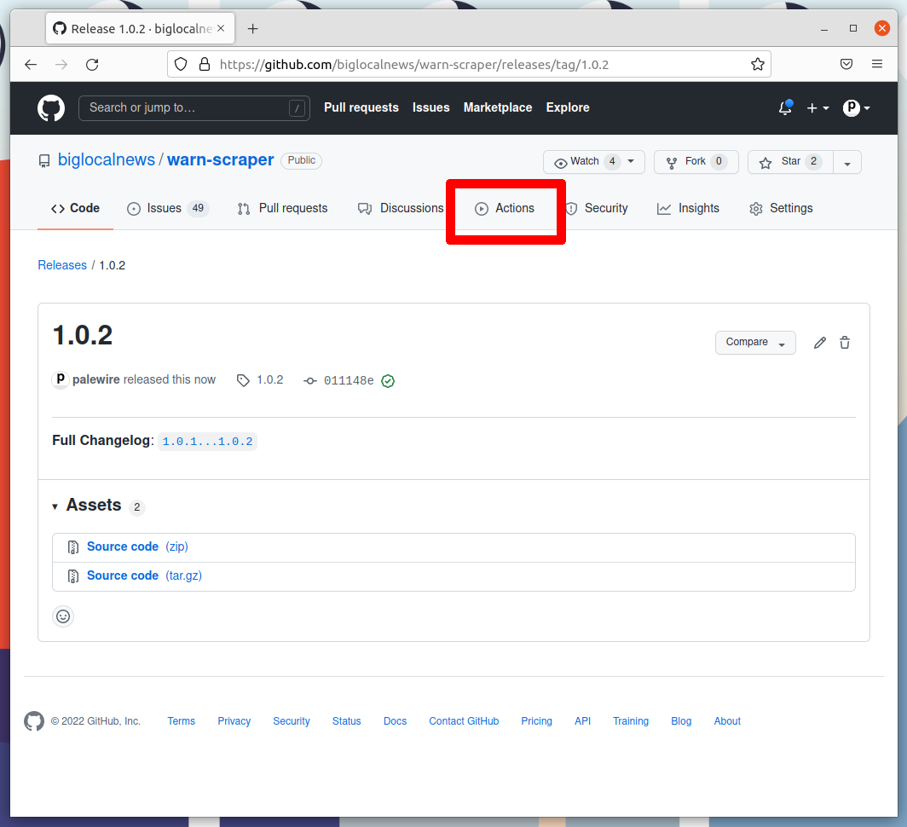
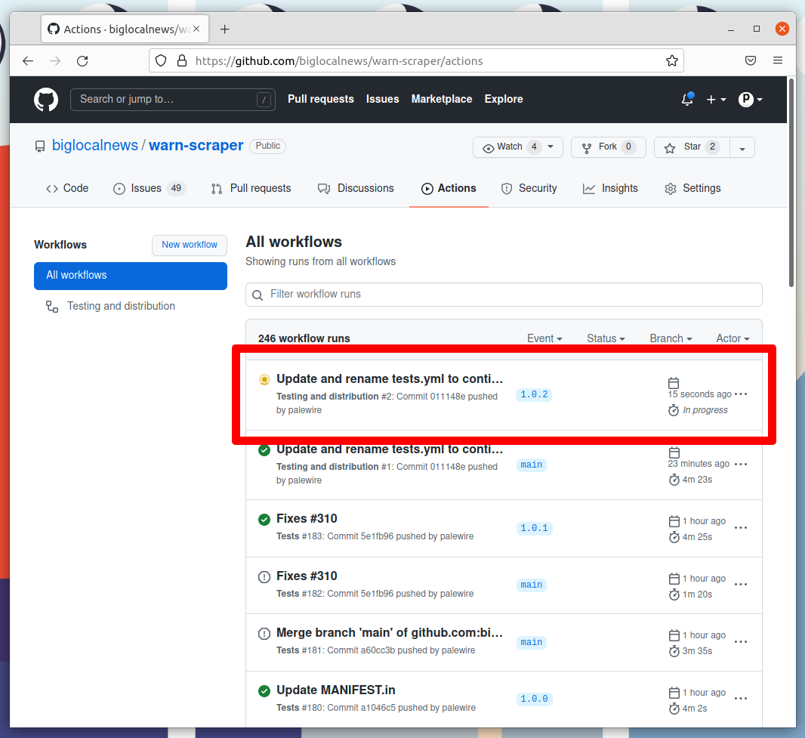

# Releasing

Our release process is automated as a [continuous deployment](https://en.wikipedia.org/wiki/Continuous_deployment) via the [GitHub Actions](https://github.com/features/actions) framework. The logic that governs the process is stored [in the `workflows` directory](https://github.com/biglocalnews/court-scraper/blob/main/.github/workflows/continuous-deployment.yml).

That means that everything necessary to make a release can be done with a few clicks on the GitHub website. All you need to do is make a tagged release at [biglocalnews/court-scraper/releases](https://github.com/biglocalnews/court-scraper/releases), then wait for the computers to handle the job.

Here's how it's done, step by step. The screenshots are from a different repository, but the process is the same.

## 1. Go to the releases page

The first step is to visit [our repository's homepage](https://github.com/biglocalnews/court-scraper) and click on [the "releases" headline](https://github.com/biglocalnews/court-scraper/releases) in the right rail.

## 2. Click 'Draft a new release'

Note the number of the latest release. Click the "Draft a new release" button in the upper-right corner. If you don't see this button, you do not have permission to make a release. Only the maintainers of the repository are able to release new code.

## 3. Create a new tag

Think about how big your changes are and decide if you're a major, minor or patch release.

All version numbers should feature three numbers separated by the periods, like `1.0.1`. If you're making a major release that isn't backwards compatible, the latest release’s first number should go up by one. If you're making a minor release by adding a feature or major a large change, the second number should go up. If you're only fixing bugs or making small changes, the third number should go up.

If you're unsure, review the standards defined at [semver.org](https://semver.org) to help make a decision. In the end don't worry about it too much. Our version numbers don't need to be perfect. They just need to be three numbers separated by periods.

Once you've settled on the number for your new release, click on the "Choose a tag" pull down.

Enter your version number into the box. Then click the "Create new tag" option that appears.

## 4. Name the release

Enter the same number into the "Release title" box.

## 5. Auto-generate release notes

Click the "Auto-generate release notes" button in the upper right corner of the large description box.

That should fill in the box below. What appears will depend on how many pull requests you've merged since the last release.

## 6. Publish the release

Click the green button that says "Publish release" at the bottom of the page.

## 7. Wait for the Action to finish

GitHub will take you to a page dedicated to your new release and start an automated process that release our new version to the world. Follow its progress by clicking on the [Actions tab](https://github.com/biglocalnews/court-scraper/actions) near the top of the page.

That will take you to the Actions monitoring page. The task charged with publishing your release should be at the top.

After a few minutes, the process there should finish and show a green check mark. When it does, visit [court-scraper’s page on PyPI](https://pypi.org/project/court-scraper/), where you should see the latest version displayed at the top of the page.

If the action fails, something has gone wrong with the deployment process. You can click into its debugging panel to search for the cause or ask the project maintainers for help.
